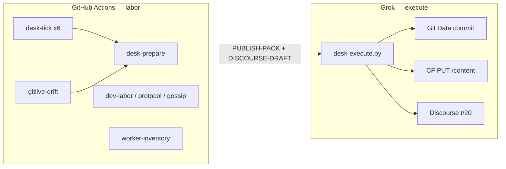

# EDGE-GROK Actions package

**Purpose:** all *laborious* desk/dev automation runs on **public GitHub-hosted Linux** (net **$0**). **Execute** of git + live + Discourse stays **on Grok**.

```bash
# Grok only (Q-gated). Actions never runs this:
python3 ops/bin/desk-execute.py --git --live --discourse
```

Locked: no `workers.dev`, no 6th CF cron, no wrangler **deploy** from GHA, probe **`/health`** not status-worker **`/status`**, lab `n=1` / `mesh_member=false`.

## Split of labour



| Actions (labor, $0 runners) | Grok (execute) |
|---|---|
| `/health` canary + Fog honesty | `commit_files` Git Data API |
| GraphQL remaining + circuit | CF `PUT /scripts/{id}/content` |
| live SHA vs git drift | Discourse reply t/20 |
| 5-cron inventory | Fog + cloudflared process |
| protocol / process-gossip / metabolism tests | Judgment, P0 narrative |
| secrets-guard on PRs | SuperGrok chat |
| Discourse **draft** + execute recipe on #52 | |
| origin-archive tarball | |

`desk-publish` from Actions is **prepare only**. If `GITHUB_ACTIONS` is set, `desk-execute.py` exits 2.

Hourly Grok `#52` *observe* retires after 48h green ticks. Grok *execute* stays one command at Lisbon peaks.

## Cadence (UTC = WEST−1 in August)

| UTC cron | Lisbon | Actions | Grok |
|---|---|---|---|
| `0 3 * * *` | 04:00 | tick + prepare | — |
| `0 8 * * *` | 09:00 | tick + prepare | execute if pack says ALLOW+drift |
| `0 11 * * *` | 12:00 | tick + prepare | — |
| `0 17 * * *` | 18:00 | tick + prepare + t/20 **draft** | `desk-execute --discourse` |
| `0 20 * * *` | 21:00 | tick + prepare | — |
| `0 22 * * *` | 23:00 | tick + prepare | execute if needed |

Prepare crons are `5 3,8,11,17,20,22` (five minutes after tick).

## Workflows

| File | Role |
|---|---|
| `desk-tick.yml` | observe |
| `desk-prepare.yml` | pack + draft + #52 hint if drift and Q-gate ALLOW |
| `desk-publish.yml` | **alias** → prepare (no PUT) |
| `dev-labor.yml` | py_compile + metabolism tests; proves execute refuses Actions |
| `gitlive-drift.yml` | hashes |
| `worker-inventory.yml` | cron cap 5 |
| `secrets-guard.yml` | PR leak scan |
| `release-lab.yml` | dispatch GitHub prerelease (tag only; Discourse still Grok) |
| `mesh-health.yml` / `metabolism.yml` / `protocol-invariants.yml` / `process-gossip.yml` / `origin-archive.yml` | existing labor |
| `wrangler-action-hold.yml` | `--version` only |

## Grok execute

Local secrets (`/tmp/god_api`, `/tmp/gh_pat`, optional `/tmp/discourse_api`) — never git, never Actions secrets for Discourse session.

```bash
python3 ops/bin/desk-execute.py --git --live --discourse
python3 ops/bin/desk-execute.py --live --scripts stratamesh-status,stratamesh-gossip
python3 ops/bin/desk-execute.py --discourse --body-file /tmp/desk-tick/DISCOURSE-DRAFT.md
```

Q-gate: live GraphQL remaining known, `hour_spent < 1.25× hourly_cap`, remaining ≥ 500. Fail closed. Allow-list Workers only.

If Discourse has no API key (Free plan), execute HOLDs the post and prints the draft — Grok session client still owns t/20.

## Secrets

| Name | Where | Used by |
|---|---|---|
| `GOD_API` / `CLOUDFLARE_EMAIL` | Actions **and** Grok `/tmp` | tick/prepare GraphQL+GET content; Grok PUT |
| `GH_PAT` | Grok `/tmp/gh_pat` only | Git Data execute |
| `DISCOURSE_API_KEY` | Grok `/tmp/discourse_api` only | t/20 execute; not required |

Do not put SuperGrok, DeoMail, Dropbox, or Reddit in Actions.

## Honesty

Fog `/status` via tunnel (not Worker 100k): `mesh_member===false`. CI never hits status-worker `/status` (17 bindings). Never `workers.dev`.
