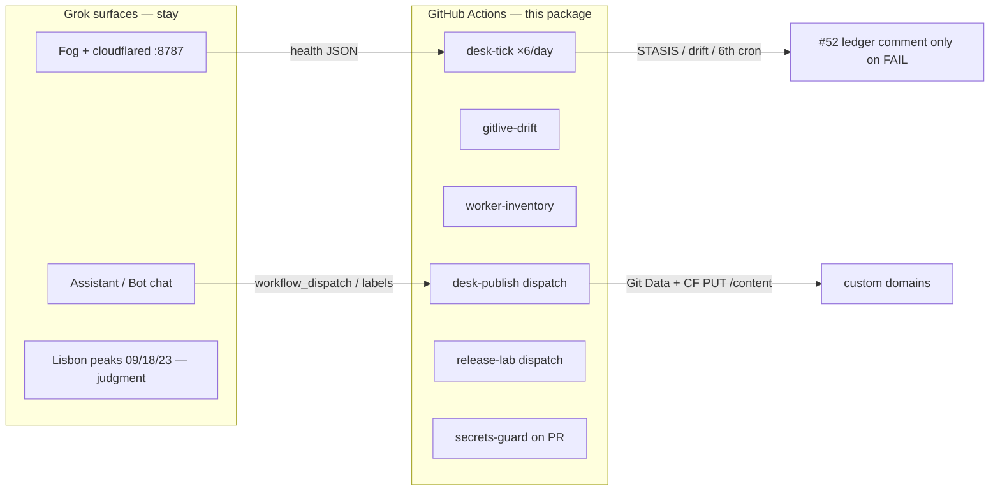

# EDGE-GROK Actions package

**Purpose:** move the automation *desk* off manual Grok sessions and the hourly SuperGrok fire onto **public GitHub-hosted Linux** (net **$0** on this org). STRATAGROK stays the Fog/tunnel host and the chat surface. Actions become the Bot’s scheduled body.

Locked to the desk contract: no `workers.dev`, no 6th CF cron, no wrangler **deploy** without a Q-gate, probe **`/health`** not status-worker **`/status`**, lab honesty `n=1` / `mesh_member=false`.

## Split of labour

| Still Grok / this host | Now Actions (public, $0) |
|---|---|
| Fog process + named tunnel | Metabolism sample (GraphQL remaining) |
| SuperGrok judgment / P0 narrative | Coalesced `/health` canary |
| Discourse t/20 when a human should speak | Git vs live Worker SHA drift |
| Anything that needs a laptop | 5-cron cap check |
| wrangler deploy by hand if Q-gate red | Q-gated Worker PUT on **dispatch** |
| | Protocol tests (already) |
| | Origin archive 00:20Z (already) |
| | Secret leak guard on PR |
| | Lab release tag on dispatch |

Hourly Grok `#52` observe-loop **retires after 48h of green `desk-tick`**. Six Lisbon-aligned crons replace twenty-four SuperGrok fires.

## Cadence (UTC = WEST−1 in August)

| UTC cron | Lisbon | Slot |
|---|---|---|
| `0 3 * * *` | 04:00 | watchdog |
| `0 8 * * *` | 09:00 | dev-cycle peak |
| `0 11 * * *` | 12:00 | midday observe |
| `0 17 * * *` | 18:00 | discourse-pulse (observe; no auto-post) |
| `0 20 * * *` | 21:00 | evening |
| `0 22 * * *` | 23:00 | night-diagnostic peak |

That is **`grok-auto` 6/day**, not a 24h firehose.

## Workflows

| File | Trigger | Secrets | Spends CF 100k? |
|---|---|---|---|
| `desk-tick.yml` | those 6 crons + dispatch | `GOD_API` optional | ~6 `/health` GETs |
| `gitlive-drift.yml` | 6h + dispatch | `GOD_API` | CF API only (not eyeball 100k) |
| `worker-inventory.yml` | daily 00:40Z + dispatch | `GOD_API` | CF API; **fails if cron > 5** |
| `desk-publish.yml` | **dispatch only** | `GOD_API` + `GH_PAT` optional | Q-gated PUT `/content` |
| `release-lab.yml` | **dispatch only** | `GITHUB_TOKEN` | none |
| `secrets-guard.yml` | pull_request | none | none |
| `mesh-health.yml` | 09:00Z + dispatch | none | `/health` only |
| `metabolism.yml` | push/PR on rails | none | none (unit tests) |
| `protocol-invariants.yml` / `process-gossip.yml` | push/PR `src/**` | none | none |
| `origin-archive.yml` | 00:20Z | `GITHUB_TOKEN` | none |
| `wrangler-action-hold.yml` | dispatch | **none** | `wrangler --version` only |

## Secrets (GitHub, never git)

Set on `StrataMesh-Laboratory/stratamesh-core` (and org if you want the other public repos to call `workflow_call` later):

| Name | Used by | Notes |
|---|---|---|
| `GOD_API` | tick, drift, inventory, publish | `cfat_` write token. GraphQL + Workers + tunnels. |
| `CLOUDFLARE_EMAIL` | same | `X-Auth-Email` first, then Bearer. |
| `GH_PAT` | publish only | `ghp_` if `GITHUB_TOKEN` cannot write `main` (branch protection). |
| `DISCOURSE_API_KEY` | not wired yet | 18:00 pulse stays human until you opt in. |

Do **not** store SuperGrok, DeoMail, Dropbox, or Reddit tokens in Actions. Those are chat/desk, not CI.

## Q-gate (publish)

`desk-publish` will **HOLD** (exit 0 with notice, no PUT) unless:

1. Live GraphQL `remaining = 100000 − day_used` is known (fail closed if GraphQL dies).
2. `hour_spent < 1.25 × (remaining / hours_until_00:00Z)`.
3. Requested script is in the allow-list (no surprise 40th Worker).
4. Cron count still 5.
5. Body is not `workers.dev`.

This is `ops/lib/metabolism.py` `decide("cf-worker-req")`, not a second Pages 100k.

## Honesty canary (tick fails the job)

- Fog `/status` (tunnel origin, **not** the status Worker): `mesh_member===false`, `oracle_live===false`, version starts `0.2.3`.
- Gossip `/health`: custom-domain host, not `workers.dev`.
- Status `/health`: 200 JSON, no fan-out.
- Any probe URL containing `workers.dev` → STASIS fail.

Fog `/status` does **not** spend the Worker 100k (cloudflared → `:8787`). Status Worker `/status` **does** (17 bindings) — never from CI.

## What this does *not* automate

- Closing P0 (needs a second real host).
- Oracle grok90 tenancy.
- Hugging Face until 2026-09-01.
- Reddit (banned).
- Paying STRATA / on-chain.
- A 6th CF cron, plan upgrades, AWS paid.

## Retire the hourly Grok fire

Once `desk-tick` is green across **two Lisbon days**, disable Grok automation `#52` FREQ=HOURLY. Keep the four human peaks as chat if you want judgment; the observe/publish bus is Actions.

## Labels (optional desk UI)

| Label | Meaning |
|---|---|
| `gha:tick` | last tick failed — read Actions log, not a new Grok thread |
| `gha:drift` | live Worker ≠ git |
| `gha:hold` | metabolism HOLD/STASIS |
| `gha:publish` | human asked for `desk-publish` dispatch |

EDGE-GROK PRs still merge under the desk contract; André merges protocol/economy.
